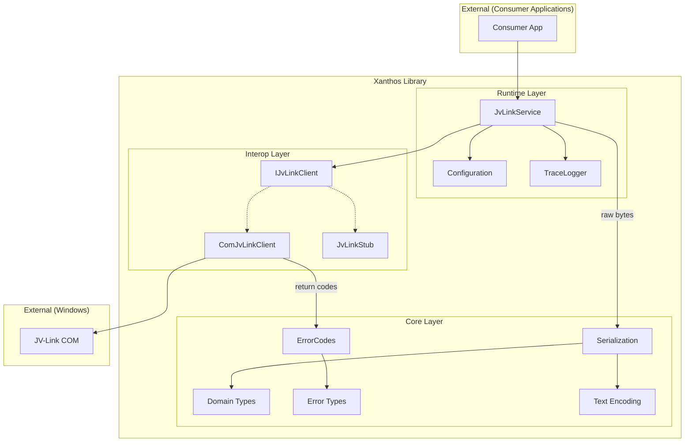
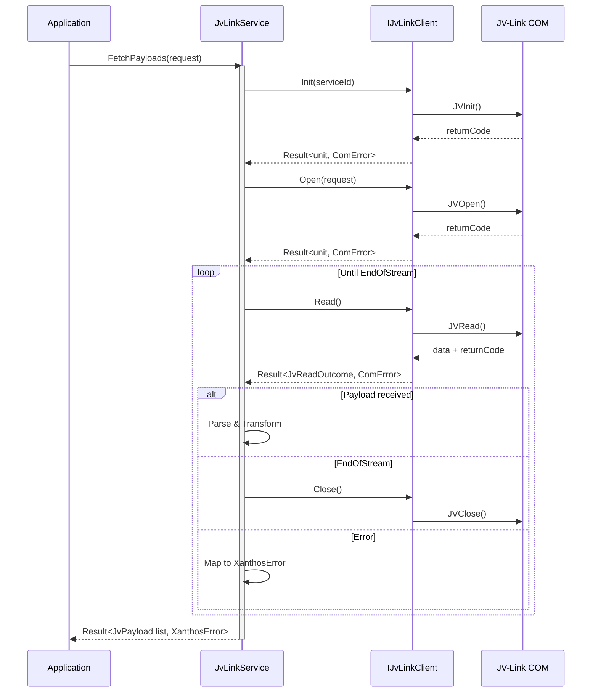
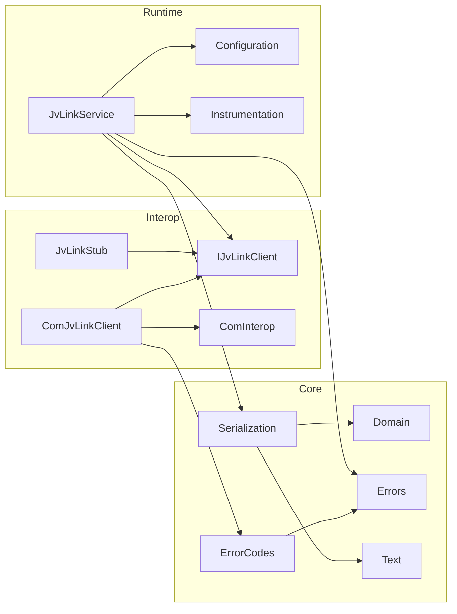

# Xanthos Modern Library Design

This document captures the target architecture for a maintainable, testable F# library that wraps the JRA-VAN JV-Link COM components. The implementation now targets .NET 10.0 / F# 9, is NuGet-friendly, and ships with a COM-free test harness that exercises the library via stubs and property-based specifications.

## Document Map

| File | Summary |
|------|---------|
| `README.md` (this file) | High-level architecture, design goals, and layer breakdown. |
| [`api-coverage.md`](api-coverage.md) | Tracks which JV-Link APIs are already wrapped, pending, or explicitly unsupported. |
| [`record-parser.md`](record-parser.md) | Details the fixed-length record parsing engine, encoding rules, and property-based verification strategy. |
| [`sta-dispatcher.md`](sta-dispatcher.md) | Explains the STA dispatcher that hosts JV-Link COM calls and how it integrates with `JvLinkService`. |

---

## 1. Design Goals

- **Idiomatic F# API**: expose strongly-typed domain models, discriminated unions, and computation expressions that hide COM-era details.
- **Isolation from COM**: provide interfaces/abstractions so applications and tests can execute without the actual JV-Link runtime.
- **Composable Pipelines**: support synchronous workflows today with planned `Task`-based variants for integration into background services and server processes.
- **Testability**: offer in-process stubs, fake data sources, and property-based verification for parsers and transformations.
- **Packaging**: multi-target library ready for NuGet distribution, with XML docs and optional analyzer packages.
- **Traceability**: maintain an [API coverage matrix](api-coverage.md) that tracks implementation status across all public JV-Link methods and properties from the official specification.
- **Layer Discipline**: keep responsibilities between core, interop, and runtime modules clear (see section 4).
- **Data Parsing**: support fixed-length JV-Data records via a dedicated [record parser system](record-parser.md) that handles Shift-JIS encoding and code table lookups.
- **Simplicity**: maintain a minimal layer structure appropriate for the fixed API scope.

---

## 2. Architectural Decision

### Why Three Layers?

The JV-Link API specification defines a fixed scope:
- **26 methods** (JVInit, JVOpen, JVRead, etc.)
- **9 properties** (m_saveflag, m_savepath, etc.)

Given this constraint, we deliberately chose a **simple 3-layer architecture** over more complex patterns like Clean Architecture or Hexagonal Architecture.

### Considered Alternatives

| Architecture | Layers | Verdict |
|--------------|--------|---------|
| Current (3-layer) | Core → Interop → Runtime | ✅ Appropriate |
| Clean Architecture | Domain → Application → Infrastructure → Presentation | ❌ Over-engineering |
| Hexagonal (Ports & Adapters) | Domain ← Ports → Adapters | ⚠️ Partial adoption via `IJvLinkClient` |

### Rationale

1. **Fixed API scope**: No significant growth expected; additional layers would add indirection without benefit.
2. **Maintainability**: Fewer layers mean easier navigation and lower cognitive load.
3. **F# idioms**: The current structure aligns with typical F# library conventions.
4. **Sufficient abstraction**: `IJvLinkClient` already provides the port/adapter pattern where it matters most (COM isolation).

### Dependency Direction

```
Application (Consumer)
       ↓
    Runtime    ← Orchestration, logging, configuration
       ↓
    Interop    ← COM abstraction, stubs
       ↓
     Core      ← Domain types, errors, serialization
```

This is a traditional layered dependency (not inverted), which is acceptable for this project's scope. The key abstraction (`IJvLinkClient`) enables testing without COM, which is the primary architectural concern.

---

## 3. Project Structure (current + planned evolutions)

```
src/
 └─ Xanthos/
     ├─ Core/             # Domain types, errors, serialization helpers
     ├─ Interop/          # IJvLink abstraction, COM client, stubs
     └─ Runtime/          # JvLinkService orchestration + logging

design/
 ├─ architecture/         # (this file) future-facing design notes
 ├─ specs/                # Markdown exports of official specifications
 └─ source-docs/          # Raw official documents (HTML/PDF/Excel)

tests/
 ├─ Xanthos.UnitTests/     # xUnit deterministic tests
 └─ Xanthos.PropertyTests/ # FsCheck property suites
```

**Multi-targeting**: the library currently ships as `net10.0` and `net10.0-windows` (COM references only attach to the Windows target). Additional TFMs (for example, `net8.0`) can be layered in once compatibility requirements are confirmed.

---

## 3.1 Text Encoding Policy

Xanthos uses a strict boundary-based encoding policy to prevent mojibake and to keep record parsing deterministic.

- **In-memory text**: Unicode `string` (UTF-16). This is the only supported internal text representation.
- **JV-Link boundary (input)**: treat JV-Link “text” as CP932/Shift-JIS and decode into `string` via `Xanthos.Core.Text` helpers (including COM BSTR recovery for buggy out-params).
- **Binary payloads**: keep raw `byte[]` as-is; record parsers decode specific field slices from Shift-JIS when (and only when) they are text.
- **Output boundary (text output)**: console/log/file text is UTF-8 (no BOM). Console apps should call `Xanthos.Runtime.ConsoleEncoding.configureUtf8()` at startup.

## 4. Layered Architecture

The library consists of three internal layers. Consumers (applications) are external and interact only with the Runtime layer's public API.

### 4.1 Core Layer (`Xanthos.Core`)

The foundation layer with no dependencies on other Xanthos layers.

- `Domain.fs`: discriminated unions for races, runners, odds snapshots, payload envelopes, and watch events.
- `Errors.fs`: layered error DU (`ComError`, `XanthosError`) plus helpers such as `Errors.mapComResult`.
- `ErrorCodes.fs`: centralised JV-Link return-code → `ComError` mapping with descriptive messages.
- `Serialization.fs`: JSON encoders/decoders that convert JV-Link payloads into `RaceInfo` / `RaceOdds` without requiring COM; all payloads are decoded from Shift-JIS using `Text.decodeShiftJis` before being normalised.
- `Text.fs`: encoding helpers that convert JV-Link Shift-JIS buffers into Unicode and normalise legacy characters (half-width Katakana → full-width, full-width digits/letters → ASCII).
- `Records/`: fixed-length record parsers for JV-Data binary payloads (TK, RA, SE, HR, O1-O6, WF, JC, etc.). These parsers extract fields from fixed-byte-position records, normalise text, and convert to domain types. Called by the Runtime layer after receiving raw bytes from Interop. See [record-parser.md](record-parser.md) for detailed design.
- `Records/CodeTables.fs`: strongly typed enumerations for JV code values (sex, hair colour, track condition, etc.).

### 4.2 Interop Layer (`Xanthos.Interop`)

Depends on Core for error types and domain definitions.

- `IJvLinkClient`: minimal interface describing JV-Link calls (`Init`, `Open`, `Read`, `Close`, etc.), property accessors, and metadata (save path, service key, timestamps).
- `ComJvLinkClient`: late-bound COM wrapper guarded behind the `net10.0-windows` TFM; converts return codes via `ErrorCodes.interpret` to `ComError`.
- `JvLinkStub`: thread-safe queue-based stub used by unit and property tests to simulate streaming payloads, failures, and end-of-stream.
- Helper modules (`ComInterop.fs`) collect reusable marshaling helpers.

### 4.3 Runtime Layer (`Xanthos.Runtime`)

Depends on both Core and Interop. This is the primary public API for consumers.

- `JvLinkService`: orchestrates `Init` → `Open` → `Read` loops, normalises `ComError` into `XanthosError`, and logs via `TraceLogger`.
- `Configuration.fs`: `JvLinkConfig` record with validation helpers.
- `Instrumentation.fs`: simple logging façade (silent/console); can be replaced with adapters to structured loggers as needed.
- `WatchEvents`: event-driven streaming via `IObservable<Result<WatchEvent, XanthosError>>`. The library uses `IObservable` for push-based event callbacks (natural for COM event semantics), while batch/streaming data uses `IAsyncEnumerable` for pull-based consumption.
- Future: richer pipelines (`downloadRaceCard`, `streamOddsUpdates`), caching strategies, and concurrency primitives.

### 4.4 Consumer Integration (External)

> **Note**: This section describes how external applications use the library, not a layer within the library itself.

Consumers reference the `Xanthos` NuGet package and bind `IJvLinkClient` implementations through dependency injection:

```fsharp
services
    .AddSingleton<IJvLinkClient>(fun _ -> ComJvLinkClient())
    .AddSingleton<JvLinkService>()
```

Test projects replace `IJvLinkClient` with `JvLinkStub` or custom doubles.

### 4.5 Architecture Diagrams

#### Data Flow Diagram



**Data flow explanation**: Consumer applications call `JvLinkService` (Runtime), which orchestrates calls to `IJvLinkClient` (Interop). The Interop layer retrieves raw byte arrays from JV-Link COM and converts return codes to `ComError` via `ErrorCodes`. The Runtime layer then passes raw bytes to `Serialization` (Core) for parsing into domain types. Error mapping flows through `ErrorCodes → Errors`.

#### Sequence Diagram: Payload Retrieval



#### Module Dependencies



---

## 5. Runtime API Usage Examples

This section demonstrates common usage patterns for consumers of the library.

### 5.1 Fetching Race Data

```fsharp
open Xanthos.Core
open Xanthos.Interop
open Xanthos.Runtime

// Create configuration
// Parameters: serviceKey, savePath, saveFlag, useJvGets
let config =
    match JvLinkConfig.create "YOUR_SERVICE_ID" None None None with
    | Ok cfg -> cfg
    | Error err -> failwithf "Config error: %A" err

// Production: use COM client
let client = ComJvLinkClient() :> IJvLinkClient

// Testing: use stub
// let client = JvLinkStub(payloads) :> IJvLinkClient

let service = JvLinkService(client, config)
let request =
    { Spec = "RACE"
      FromTime = DateTime(2024, 1, 1)
      Option = 1 }

// Fetch race card data
match service.FetchPayloads(request) with
| Ok payloads ->
    for payload in payloads do
        match Serialization.parseRaceCard payload.Data with
        | Ok races -> printfn "Parsed %d races" races.Length
        | Error err -> printfn "Parse error: %A" err
| Error err ->
    printfn "Fetch error: %A" err
```

### 5.2 Real-time Odds Updates

```fsharp
// Stream real-time payloads lazily
// Key format: "YYYYMMDDJJKKHHRR" (race) or "YYYYMMDD" (daily)
for result in service.StreamRealtimePayloads("ODDS", "20240101") do
    match result with
    | Ok payload ->
        match Serialization.parseOdds payload.Data with
        | Ok odds ->
            for snapshot in odds do
                printfn "Race %s: %d entries"
                    (RaceId.value snapshot.Race)
                    snapshot.Entries.Length
        | Error err -> printfn "Parse error: %A" err
    | Error err ->
        printfn "Realtime error: %A" err
```

### 5.3 Streaming Real-time Odds

```fsharp
// Key format: "YYYYMMDDJJKKHHRR" (race) or "YYYYMMDD" (daily), or WatchEvent parameter
service.StreamRealtimePayloads("ODDS", "20240101")
|> Seq.iter (function
    | Ok payload ->
        printfn "Realtime chunk: %d bytes" payload.Data.Length
    | Error err ->
        printfn "Realtime error: %A" err)
```

`StreamRealtimePayloads` lazily consumes `JVRTOpen`/`JVRead` output until EndOfStream, closing the session as soon as the enumerator finishes. For continuous polling, use `StreamRealtimeAsync`.

```fsharp
task {
    use cts = new CancellationTokenSource(TimeSpan.FromMinutes 1.)
    use enumerator =
        service
            .StreamRealtimeAsync("ODDS", "20240101", TimeSpan.FromMilliseconds 250., cancellationToken = cts.Token)
            .GetAsyncEnumerator()

    let mutable continueLoop = true
    while continueLoop do
        let! hasItem = enumerator.MoveNextAsync().AsTask()
        if hasItem then
            match enumerator.Current with
            | Ok payload -> printfn "Async realtime chunk %d" payload.Data.Length
            | Error err -> printfn "Async realtime error: %A" err
        else
            continueLoop <- false
}
```

`StreamRealtimeAsync` (formerly `StreamRealtimePayloadsAsync`) polls until cancelled, making it suitable for long-running background tasks or `await foreach` loops in C# consumers.

### 5.4 Parsing Watch Events

```fsharp
// Parse raw event key from JVWatchEvent callback
let rawKey = "0B1220240101120000"
let event = Serialization.parseWatchEvent rawKey

match event.Event with
| WatchEventType.PayoffConfirmed ->
    printfn "Payoff confirmed for course %s race %s"
        (event.CourseCode |> Option.defaultValue "??")
        (event.RaceNumber |> Option.defaultValue "??")
| WatchEventType.HorseWeight ->
    printfn "Horse weight update"
| WatchEventType.JockeyChange ->
    printfn "Jockey change (record %s)"
        (event.RecordType |> Option.defaultValue "")
| _ ->
    printfn "Other event: %s" event.RawKey

event.MeetingDate
|> Option.iter (fun dt -> printfn "Meeting date: %s" (dt.ToString("yyyy-MM-dd")))
```

### 5.4 Control Operations

```fsharp
// Check download status
match service.GetStatus() with
| Ok status -> printfn "Status: %d" status
| Error err -> printfn "Status error: %A" err

// Skip current file
match service.SkipCurrentFile() with
| Ok () -> printfn "Skipped"
| Error err -> printfn "Skip error: %A" err

// Cancel ongoing download
match service.CancelDownload() with
| Ok () -> printfn "Cancelled"
| Error err -> printfn "Cancel error: %A" err

// Delete cached file
match service.DeleteFile "2024010112.jvd" with
| Ok () -> printfn "Deleted"
| Error err -> printfn "Delete error: %A" err
```

### 5.6 Watching Events

```fsharp
// Subscribe to watch events
use subscription =
    service.WatchEvents.Subscribe(fun result ->
        match result with
        | Ok evt -> printfn "Event %A (%s)" evt.Event evt.RawKey
        | Error err -> printfn "Event error: %A" err)

match service.StartWatchEvents() with
| Ok () -> printfn "Watching events..."
| Error err -> printfn "Failed to start events: %A" err

// Later, stop watching
match service.StopWatchEvents() with
| Ok () -> printfn "Stopped"
| Error err -> printfn "Failed to stop events: %A" err
```

For event specifications and raw key formats, see [design/specs/events.md](../specs/events.md).

> **Note:** COM watch events can only be validated on Windows with JV-Link installed. Linux users can exercise the API shape via `JvLinkStub`, but the actual `JVEvt*` callbacks must be verified on real Windows hardware.

### 5.7 Retrieving Silks Images

```fsharp
let pattern = "ｽｲｿﾞｸ,赤山形一本輪,水色袖"
let targetPath = @"C:\\tmp\\silks.bmp"

// Persist bitmap to disk via JVFukuFile
match service.GenerateSilksFile(pattern, targetPath) with
| Ok silks when silks.FilePath = Some targetPath ->
    printfn "Silks saved to %s" targetPath
| Ok _ ->
    printfn "Silks file generated, but target path differs"
| Error err ->
    printfn "Silks file generation failed: %A" err

// Retrieve bitmap as in-memory bytes via JVFuku
match service.GetSilksBinary(pattern) with
| Ok silks when silks.Data.IsSome ->
    let bytes = silks.Data.Value
    printfn "Silks image size: %d bytes" bytes.Length
| Ok _ ->
    printfn "Silks binary request returned no data"
| Error err ->
    printfn "Silks binary request failed: %A" err
```

Both helpers normalise the legacy Shift-JIS pattern via `Text.normalizeJvText`, ensuring half-width katakana and full-width digits are converted to modern Unicode before invoking `JVFukuFile`/`JVFuku`.

### 5.8 Configuring JV-Link Session Properties

```fsharp
// Persist downloads to disk
match service.SetSaveDownloadsEnabled true with
| Ok () -> printfn "Caching enabled"
| Error err -> printfn "Failed to enable caching: %A" err

// Update save path and service key
service.SetSavePath @"D:\\JVDATA" |> ignore
service.SetServiceKey "12345678901234567" |> ignore

// Suppress payoff dialogs.
// NOTE: In COM mode, m_payflag is effectively read-only (writes fail). Use ShowConfigurationDialog().
match service.SetPayoffDialogSuppressed true with
| Ok () -> ()
| Error (Unsupported _) -> printfn "Payoff dialog suppression is not supported in COM mode; use ShowConfigurationDialog()."
| Error err -> printfn "Failed to configure payoff dialogs: %A" err

// Set owner window for JV-Link dialogs (ParentHWnd).
// NOTE: ParentHWnd is write-only in COM mode (cannot be read back).
service.SetParentWindowHandle(IntPtr 0x00012345) |> ignore

// Launch JV-Link UI dialog (same options exposed interactively)
service.ShowConfigurationDialog() |> ignore

// Query JV-Link status properties (all return Result types)
match service.GetJVLinkVersion() with
| Ok version -> printfn "JV-Link %s" version
| Error err -> printfn "Failed to get version: %A" err

match service.GetTotalReadFileSizeBytes() with
| Ok size -> printfn "Total bytes remaining: %d" size
| Error err -> printfn "Failed to get total size: %A" err

match service.GetCurrentReadFileSize() with
| Ok size -> printfn "Current file size: %d" size
| Error err -> printfn "Failed to get current size: %A" err
```

These helpers wrap the COM properties (`m_saveflag`, `m_savepath`, `m_servicekey`, `m_payflag`, `ParentHWnd`, etc.) while surfacing idiomatic F# APIs and error handling (including COM read/write limitations).

### 5.9 Fetching Workout Video Listings

```fsharp
match service.FetchWorkoutVideos(MovieType.WorkoutWeekAll, "20240101") with
| Ok listings ->
    listings
    |> List.iter (fun entry ->
        printfn "Workout %s registration %s" entry.RawKey (entry.RegistrationId |> Option.defaultValue "-"))
| Error err ->
    printfn "Failed to fetch workout videos: %A" err
```

`FetchWorkoutVideos` wraps `JVMVOpen`/`JVMVRead`, normalises the returned key, and parses the date/registration number into `WorkoutVideoListing`. The helper automatically initialises JV-Link, ensures the session is closed, and surfaces any COM failures as `XanthosError` values.

---

## 6. COM Abstraction & Stubs

### 6.1 Interface Definition

The authoritative definition lives in `src/Xanthos/Interop/IJvLinkClient.fs`. This excerpt shows the core shape:

```fsharp
type JvReadOutcome =
    | Payload of JvPayload
    | FileBoundary
    | DownloadPending
    | EndOfStream

type IJvLinkClient =
    abstract member Init: sid: string -> Result<unit, ComError>
    abstract member Open: request: JvOpenRequest -> Result<JvOpenResult, ComError>
    abstract member OpenRealtime: spec: string * key: string -> Result<JvOpenResult, ComError>
    abstract member Read: unit -> Result<JvReadOutcome, ComError>
    abstract member Gets: buffer: byref<string> * bufferSize: int * filename: byref<string> -> Result<int, ComError>
    abstract member Close: unit -> unit
    // ... additional JV-Link methods and properties
```

> **Note**: `OpenRealtime` takes a string `key` parameter matching JV-Link spec formats:
> - Race data: `"YYYYMMDDJJKKHHRR"` (e.g., `"2024010101010101"`)
> - Daily data: `"YYYYMMDD"` (e.g., `"20240101"`)
> - WatchEvent parameter (from callback)

The runtime layer lifts `Result<_, ComError>` into `Result<_, XanthosError>` to integrate with higher workflows. Event callbacks currently surface raw keys (string) which can be transformed using `Serialization.parseWatchEvent`; future work will expose a higher-level event stream API.

#### COM Client Lifecycle Management

`IJvLinkClient` itself does not require `IDisposable`, but `ComJvLinkClient` implements proper resource cleanup.
`JvLinkService` disposes the injected client when it implements `IDisposable`, so callers should typically dispose the service:

```fsharp
// Option 1: Use ComClientFactory with 'use' binding
// Parameter: useJvGets (None = env vars; XANTHOS_USE_JVREAD opt-out, XANTHOS_USE_JVGETS legacy)
match ComClientFactory.tryCreate None with
| Ok client ->
    use service = JvLinkService(client, config, logger)
    // ... use service ...
    // Service (and underlying client) is disposed when 'use' scope exits
| Error err -> printfn "COM activation failed: %A" err

// Option 2: With DI container (automatic disposal)
// Register as scoped/transient; container handles disposal

// Option 3: Manual disposal
match ComClientFactory.tryCreate None with
| Ok client ->
    let service = JvLinkService(client, config, logger)
    try
        // ... use service ...
    finally
        service.Dispose()
| Error err -> printfn "COM activation failed: %A" err
```

Disposal performs the following cleanup:
- Disconnects COM event subscription
- Clears event callback references
- Calls `JVClose` to close any open session
- Releases the COM object via `Marshal.FinalReleaseComObject`

### 6.2 Pure Stubs

- `JvLinkStub` stores scripted responses (queues, lazy sequences) to simulate COM behaviour.
- Supports deterministic reproducibility for unit tests and property-based tests.
- Deliberately surfaces edge cases: mid-stream errors, zero-length payloads, timestamp regressions.

Example stub usage:

```fsharp
let fakeData =
    [ OddsUpdate(sampleRaceId, sampleOdds)
      OddsUpdate(sampleRaceId, tweakedOdds)
      EndOfStream ]

let stub = JvLinkStub.FromSequence(fakeData)
let service = JvLinkService(stub)
```

---

## 6. Testing Strategy

### 6.1 Frameworks

- **xUnit**: deterministic examples and service-level tests (`Xanthos.UnitTests`).
- **FsCheck + xUnit**: property-based testing in `Xanthos.PropertyTests` (custom generators ensure JV data remains realistic).
- **FsCheck Generators**: `Generators.fs` supplies `RaceId`, `RunnerId`, `RaceInfo`, `RaceOdds`, stub payload batches, and odds snapshots.
- **Optional**: add BenchmarkDotNet or NSubstitute once performance/mocking needs arise.

### 6.2 Test Projects

| Project                   | Purpose                                                                 |
|---------------------------|-------------------------------------------------------------------------|
| `Xanthos.UnitTests`        | xUnit assertions covering validation helpers, error mapping, stub flows |
| `Xanthos.PropertyTests`    | FsCheck suites verifying ID round-tripping, generator invariants, JSON parsers |

### 6.3 Property-Based Test Examples (implemented)

1. **Identifier Round-Trip**
   `RaceId` / `RunnerId` creation and `value` extraction round-trip trims whitespace and rejects blanks.

2. **Generator Invariants**
   Generated `RaceInfo`, `RunnerOdds`, and `RaceOdds` obey length, non-negativity, and UTC timestamp constraints.

3. **Serialization Round-Trip**
   `Serialization.parseOdds` and `Serialization.parseRaceCard` round-trip payloads emitted by JSON encoders built in tests.

4. **Stub Sequencing**
   `JvLinkStub` returns payload batches in the original order and safely reports end-of-stream.

### 6.4 Running Tests

```
dotnet test tests/Xanthos.UnitTests
dotnet test tests/Xanthos.PropertyTests
```

---

## 7. Documentation & Samples

- Generate XML docs (`GenerateDocumentationFile=true`) for IntelliSense.
- Consider `fsdocs` (FSharp.Formatting) for F# API documentation site.
- Ship a `samples/` directory (CLI, notebook, or F# script) demonstrating stub usage.
- Update `README.md` with quickstart & DI example for ASP.NET Core.

---

## 8. Build & Packaging

- COM references are conditioned on the Windows TFM inside `Xanthos.fsproj` so Linux/macOS builds stay COM-free.
- A future FAKE or `dotnet` script should cover restore → build → test → pack, optionally wiring into CI.

---

## 9. Migration Notes & Next Steps

- Legacy CLI project has been converted into the `Xanthos` library; modules already mirror the layered design.
- Further work: populate `Runtime` pipelines (e.g., schedulers, async streaming), add caching, and surface DTO-to-domain adapters.
- Extend API docs (`design/specs`) when modules stabilise and update samples to demonstrate DI and stub usage.
- Monitor JV-Link specification changes (`design/source-docs`) and ensure `ErrorCodes` / parsers stay aligned; add regression property tests when new records appear.

---

By adoption of this architecture, downstream consumers can install the NuGet package, stub out JV-Link interactions, and execute fast, deterministic tests that exercise all parsing and business logic. The library can then evolve independently from the COM runtime while remaining backwards-compatible for production workloads.
