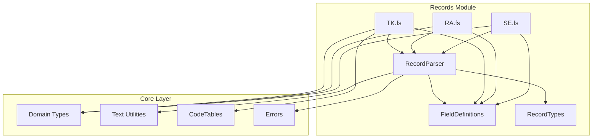

# Fixed-Length Record Parser Design

This document describes the design for parsing JV-Data fixed-length byte records as specified in the official Excel specification.

---

## 1. Overview

JV-Data payloads are fixed-length byte arrays encoded in Shift-JIS. Each record type has a unique 2-character identifier and a predefined byte layout. The parser system must:

- Decode Shift-JIS to Unicode
- Dispatch records by type identifier
- Extract fields by byte position and length
- Normalize text (half-width → full-width katakana, full-width digits → ASCII)
- Convert field values to strongly typed F# domain objects

---

## 2. Architecture

### 2.1 Module Structure

```
src/Xanthos/Core/
├── Records/
│   ├── RecordParser.fs      # Core parsing infrastructure
│   ├── FieldDefinitions.fs  # Field definition DSL
│   ├── RecordTypes.fs       # Record type discriminated union
│   ├── TK.fs                # Special Registration
│   ├── RA.fs                # Race Details
│   ├── SE.fs                # Runner Race Info
│   ├── HR.fs                # Payoff
│   ├── H1.fs                # Win/Place Payoff
│   ├── H6.fs                # Trio Payoff
│   ├── O1.fs                # Win Odds
│   ├── O2.fs                # Place Odds
│   ├── WF.fs                # Horse Weight
│   ├── JC.fs                # Jockey Change
│   └── ...                  # Other record types
├── CodeTables.fs            # Code table enumerations
├── Text.fs                  # Existing text utilities
└── Serialization.fs         # Existing JSON serialization
```

### 2.2 Dependency Flow



---

## 3. Core Components

### 3.1 Field Definition DSL

A type-safe DSL for defining field extraction rules:

```fsharp
module FieldDefinitions =

    /// Represents a field position in a fixed-length record
    type FieldSpec = {
        Name: string
        ByteOffset: int
        ByteLength: int
        Encoding: FieldEncoding
    }

    and FieldEncoding =
        | Text                    // Shift-JIS text, normalized
        | TextRaw                 // Shift-JIS text, no normalization
        | Integer                 // Numeric string → int
        | Decimal of precision:int // Numeric string → decimal
        | Date of format:string   // Date string → DateTime option
        | Code of codeTable:string // Code value → enum
        | Flag                    // "0"/"1" → bool
        | Bytes                   // Raw bytes

    /// Define a text field
    let text name offset length =
        { Name = name; ByteOffset = offset; ByteLength = length; Encoding = Text }

    /// Define an integer field
    let int name offset length =
        { Name = name; ByteOffset = offset; ByteLength = length; Encoding = Integer }

    /// Define a decimal field with precision
    let decimal name offset length precision =
        { Name = name; ByteOffset = offset; ByteLength = length; Encoding = Decimal precision }

    /// Define a date field
    let date name offset length format =
        { Name = name; ByteOffset = offset; ByteLength = length; Encoding = Date format }

    /// Define a code table field
    let code name offset length table =
        { Name = name; ByteOffset = offset; ByteLength = length; Encoding = Code table }

    /// Define a flag field
    let flag name offset length =
        { Name = name; ByteOffset = offset; ByteLength = length; Encoding = Flag }
```

### 3.2 Record Parser Infrastructure

```fsharp
module RecordParser =

    open System
    open System.Text
    open FieldDefinitions

    /// Result of parsing a single field
    type FieldValue =
        | TextValue of string
        | IntValue of int option
        | DecimalValue of decimal option
        | DateValue of DateTime option
        | BoolValue of bool
        | BytesValue of byte[]

    /// Extracts raw bytes for a field
    let extractBytes (data: byte[]) (spec: FieldSpec) : byte[] =
        if spec.ByteOffset + spec.ByteLength > data.Length then
            Array.empty
        else
            data.[spec.ByteOffset .. spec.ByteOffset + spec.ByteLength - 1]

    /// Decodes bytes to string using Shift-JIS
    let private decodeField (bytes: byte[]) : string =
        Text.decodeShiftJis bytes

    /// Parses a field according to its specification
    let parseField (data: byte[]) (spec: FieldSpec) : Result<FieldValue, string> =
        let bytes = extractBytes data spec
        if bytes.Length = 0 then
            Error $"Field '{spec.Name}' out of bounds"
        else
            match spec.Encoding with
            | Text ->
                bytes
                |> decodeField
                |> Text.normalizeJvText
                |> String.trim
                |> TextValue
                |> Ok

            | TextRaw ->
                bytes
                |> decodeField
                |> String.trim
                |> TextValue
                |> Ok

            | Integer ->
                let text = bytes |> decodeField |> String.trim
                if String.IsNullOrWhiteSpace text then
                    Ok (IntValue None)
                else
                    match Int32.TryParse text with
                    | true, value -> Ok (IntValue (Some value))
                    | false, _ -> Error $"Field '{spec.Name}' is not a valid integer"

            | Decimal precision ->
                let text = bytes |> decodeField |> String.trim
                if String.IsNullOrWhiteSpace text then
                    Ok (DecimalValue None)
                else
                    match Decimal.TryParse text with
                    | true, value ->
                        let scaled = value / (pown 10M precision)
                        Ok (DecimalValue (Some scaled))
                    | false, _ -> Error $"Field '{spec.Name}' is not a valid decimal"

            | Date format ->
                let text = bytes |> decodeField |> String.trim
                if String.IsNullOrWhiteSpace text || text = "00000000" then
                    Ok (DateValue None)
                else
                    match DateTime.TryParseExact(text, format, null, Globalization.DateTimeStyles.None) with
                    | true, value -> Ok (DateValue (Some value))
                    | false, _ -> Error $"Field '{spec.Name}' is not a valid date"

            | Code _ ->
                bytes
                |> decodeField
                |> Text.normalizeJvText
                |> String.trim
                |> TextValue
                |> Ok

            | Flag ->
                let text = bytes |> decodeField |> String.trim
                Ok (BoolValue (text = "1"))

            | Bytes ->
                Ok (BytesValue bytes)

    /// Record type identifier (first 2 bytes)
    let getRecordType (data: byte[]) : string =
        if data.Length < 2 then
            ""
        else
            data.[0..1] |> decodeField

    /// Record length indicator (bytes 2-7)
    let getRecordLength (data: byte[]) : int option =
        if data.Length < 8 then
            None
        else
            let text = data.[2..7] |> decodeField |> String.trim
            match Int32.TryParse text with
            | true, value -> Some value
            | false, _ -> None
```

### 3.3 Record Type Discriminated Union

```fsharp
module RecordTypes =

    /// All supported JV-Data record types
    type JvRecordType =
        // Race information
        | TK  // Special registration list
        | RA  // Race details
        | SE  // Runner race info
        | HR  // Payoff summary
        // Payoff details
        | H1  // Win/Place payoff
        | H6  // Trio payoff
        | H5  // Quinella place payoff
        // Odds
        | O1  // Win odds
        | O2  // Place odds
        | O3  // Bracket quinella odds
        | O4  // Quinella odds
        | O5  // Wide (quinella place) odds
        | O6  // Trio odds
        // Updates
        | WF  // Horse weight
        | JC  // Jockey change
        | TC  // Start time change
        | CC  // Course change
        | WE  // Weather / track condition change
        | AV  // Scratches / exclusions
        // Master data
        | UM  // Horse master
        | KS  // Jockey master
        | CH  // Trainer master
        | BR  // Breeder master
        | BN  // Owner master
        | RC  // Record master
        // Other
        | CS  // Course info
        | HN  // Bloodline info
        | SK  // Hill training
        | Unknown of string

    /// Parse record type identifier
    let parse (typeId: string) : JvRecordType =
        match typeId.ToUpperInvariant() with
        | "TK" -> TK
        | "RA" -> RA
        | "SE" -> SE
        | "HR" -> HR
        | "H1" -> H1
        | "H6" -> H6
        | "H5" -> H5
        | "O1" -> O1
        | "O2" -> O2
        | "O3" -> O3
        | "O4" -> O4
        | "O5" -> O5
        | "O6" -> O6
        | "WF" -> WF
        | "JC" -> JC
        | "TC" -> TC
        | "CC" -> CC
        | "WE" -> WE
        | "AV" -> AV
        | "UM" -> UM
        | "KS" -> KS
        | "CH" -> CH
        | "BR" -> BR
        | "BN" -> BN
        | "RC" -> RC
        | "CS" -> CS
        | "HN" -> HN
        | "SK" -> SK
        | other -> Unknown other
```

---

## 4. Record Implementation Example

### 4.1 Special Registration (TK) Parser

```fsharp
module TK =

    open System
    open FieldDefinitions
    open RecordParser

    /// Field definitions for TK record (21,657 bytes)
    let private fields = [
        text "RecordType" 0 2
        int "RecordLength" 2 6
        text "DataDiv" 8 1
        date "RegisterDate" 9 8 "yyyyMMdd"
        text "RaceKey" 17 16
        text "RaceName" 33 60
        text "RaceNameShort" 93 8
        text "RaceNameSub" 101 18
        int "RaceNameAge" 119 1
        text "RaceGrade" 120 1
        text "RaceConditions" 121 60
        int "Distance" 181 4
        text "TrackCode" 185 2
        text "CourseDiv" 187 1
        // ... additional fields as per specification
    ]

    /// Parsed TK record
    type TKRecord = {
        DataDivision: string
        RegisterDate: DateTime option
        RaceKey: string
        RaceName: string
        RaceNameShort: string
        Distance: int option
        TrackCode: string
        // ... additional properties
    }

    /// Parse TK record from raw bytes
    let parse (data: byte[]) : Result<TKRecord, XanthosError> =
        result {
            let! dataDiv = parseFieldAs<string> data fields "DataDiv"
            let! registerDate = parseFieldAs<DateTime option> data fields "RegisterDate"
            let! raceKey = parseFieldAs<string> data fields "RaceKey"
            let! raceName = parseFieldAs<string> data fields "RaceName"
            let! raceNameShort = parseFieldAs<string> data fields "RaceNameShort"
            let! distance = parseFieldAs<int option> data fields "Distance"
            let! trackCode = parseFieldAs<string> data fields "TrackCode"

            return {
                DataDivision = dataDiv
                RegisterDate = registerDate
                RaceKey = raceKey
                RaceName = raceName
                RaceNameShort = raceNameShort
                Distance = distance
                TrackCode = trackCode
            }
        }
```

### 4.2 Runner Race Info (SE) Parser

```fsharp
module SE =

    open System
    open FieldDefinitions
    open RecordParser

    /// Field definitions for SE record
    let private fields = [
        text "RecordType" 0 2
        int "RecordLength" 2 6
        text "DataDiv" 8 1
        text "RaceKey" 9 16
        int "HorseNumber" 25 2
        text "HorseId" 27 10
        text "HorseName" 37 36
        text "SexCode" 73 1
        code "HairColorCode" 74 2 "HairColor"
        int "Age" 76 2
        text "EastWestDiv" 78 1
        text "TrainerCode" 79 5
        text "TrainerName" 84 34
        text "OwnerName" 118 40
        text "JockeyCode" 158 5
        text "JockeyName" 163 34
        decimal "Weight" 197 3 1
        text "WeightMark" 200 1
        int "HandicapWeight" 201 3
        // ... additional fields
    ]

    /// Parsed SE record (runner in race)
    type SERecord = {
        DataDivision: string
        RaceKey: string
        HorseNumber: int option
        HorseId: string
        HorseName: string
        Sex: string
        HairColor: string
        Age: int option
        TrainerCode: string
        TrainerName: string
        JockeyCode: string
        JockeyName: string
        Weight: decimal option
        HandicapWeight: int option
    }

    /// Parse SE record from raw bytes
    let parse (data: byte[]) : Result<SERecord, XanthosError> =
        // Implementation similar to TK
        ...
```

---

## 5. Code Tables Integration

### 5.1 Code Table Types

```fsharp
module CodeTables =

    /// Sex code enumeration.
    type SexCode =
        | Male = 1
        | Female = 2
        | Gelding = 3

    /// Hair color code enumeration.
    type HairColorCode =
        | Chestnut = 1
        | Liver = 2
        | Bay = 3
        | DarkBay = 4
        | Brown = 5
        | Black = 6
        | Gray = 7
        | Roan = 8
        | Palomino = 9

    /// Track condition code enumeration.
    type TrackConditionCode =
        | Good = 1
        | Yielding = 2
        | Soft = 3
        | Heavy = 4

    /// Racecourse code enumeration.
    type RacecourseCode =
        | Sapporo = 1
        | Hakodate = 2
        | Fukushima = 3
        | Niigata = 4
        | Tokyo = 5
        | Nakayama = 6
        | Chukyo = 7
        | Kyoto = 8
        | Hanshin = 9
        | Kokura = 10

    /// Parse code to enum
    let parseCode<'T when 'T : enum<int>> (value: string) : 'T option =
        match Int32.TryParse value with
        | true, code ->
            if Enum.IsDefined(typeof<'T>, code) then
                Some (enum<'T> code)
            else
                None
        | false, _ -> None
```

---

## 6. Record Dispatcher

### 6.1 Main Dispatcher

```fsharp
module RecordDispatcher =

    open RecordTypes
    open RecordParser

    /// Parsed record result
    type ParsedRecord =
        | TKRecord of TK.TKRecord
        | RARecord of RA.RARecord
        | SERecord of SE.SERecord
        | HRRecord of HR.HRRecord
        | WFRecord of WF.WFRecord
        | UnsupportedRecord of recordType:string * data:byte[]

    /// Parse raw bytes into typed record
    let parse (data: byte[]) : Result<ParsedRecord, XanthosError> =
        let recordType = getRecordType data |> RecordTypes.parse

        match recordType with
        | TK ->
            TK.parse data |> Result.map TKRecord
        | RA ->
            RA.parse data |> Result.map RARecord
        | SE ->
            SE.parse data |> Result.map SERecord
        | HR ->
            HR.parse data |> Result.map HRRecord
        | WF ->
            WF.parse data |> Result.map WFRecord
        | Unknown typeId ->
            Ok (UnsupportedRecord (typeId, data))
        | other ->
            Ok (UnsupportedRecord (string other, data))

    /// Parse multiple records from JV-Link payload stream
    let parseAll (payloads: JvPayload list) : Result<ParsedRecord list, XanthosError> =
        payloads
        |> List.map (fun p -> parse p.Data)
        |> collectResults
```

---

## 7. Error Handling

### 7.1 Parser Errors

```fsharp
module ParserErrors =

    /// Parser-specific error types
    type ParseError =
        | FieldOutOfBounds of fieldName:string * offset:int * length:int * dataLength:int
        | InvalidFieldFormat of fieldName:string * expectedFormat:string * actualValue:string
        | UnknownRecordType of typeId:string
        | RecordTooShort of expectedLength:int * actualLength:int
        | CodeTableLookupFailed of codeTable:string * value:string

    /// Convert parse error to XanthosError
    let toXanthosError (error: ParseError) : XanthosError =
        match error with
        | FieldOutOfBounds (name, offset, length, dataLen) ->
            validation $"Field '{name}' at offset {offset} with length {length} exceeds data length {dataLen}"
        | InvalidFieldFormat (name, expected, actual) ->
            validation $"Field '{name}' expected format '{expected}' but got '{actual}'"
        | UnknownRecordType typeId ->
            validation $"Unknown record type: {typeId}"
        | RecordTooShort (expected, actual) ->
            validation $"Record too short: expected {expected} bytes, got {actual}"
        | CodeTableLookupFailed (table, value) ->
            validation $"Code table '{table}' lookup failed for value '{value}'"
```

---

## 8. Testing Strategy

### 8.1 Unit Tests

```fsharp
[<Fact>]
let ``TK parser extracts race name correctly`` () =
    let rawBytes = createTKTestData "TOKYO2024111201" "有馬記念"
    match TK.parse rawBytes with
    | Ok record ->
        Assert.Equal("有馬記念", record.RaceName)
        Assert.Equal("TOKYO2024111201", record.RaceKey)
    | Error err -> failwithf "Parse failed: %A" err

[<Fact>]
let ``SE parser handles missing optional fields`` () =
    let rawBytes = createSETestData withEmptyWeight=true
    match SE.parse rawBytes with
    | Ok record ->
        Assert.Equal(None, record.Weight)
    | Error err -> failwithf "Parse failed: %A" err
```

### 8.2 Property-Based Tests

```fsharp
[<Property>]
let ``Field extraction round-trips through normalization`` (value: NonEmptyString) =
    let normalized = Text.normalizeJvText value.Get
    let encoded = Text.encodeShiftJis normalized
    let decoded = Text.decodeShiftJis encoded |> Text.normalizeJvText
    decoded = normalized

[<Property>]
let ``Integer fields parse valid numeric strings`` (n: PositiveInt) =
    let text = string n.Get
    let bytes = Encoding.GetEncoding("shift_jis").GetBytes(text.PadLeft(6, '0'))
    let spec = FieldDefinitions.int "test" 0 6
    match RecordParser.parseField bytes spec with
    | Ok (IntValue (Some value)) -> value = n.Get
    | _ -> false
```

---

## 9. Implementation Phases

| Phase | Scope | Records | Target |
|-------|-------|---------|--------|
| **Phase 1** | Core infrastructure | RecordParser, FieldDefinitions, CodeTables | Current |
| **Phase 2** | Race data | TK, RA, SE, HR | Next milestone |
| **Phase 3** | Odds data | O1, O2, O3, O4, O5, O6 | Following |
| **Phase 4** | Payoff data | H1, H5, H6 | Following |
| **Phase 5** | Real-time updates | WF, JC, TC, CC, WE, AV | Following |
| **Phase 6** | Master data | UM, KS, CH, BR, BN, RC | Future |

---

## 10. Integration with Existing System

### 10.1 Service Layer Usage

```fsharp
// In JvLinkService
member this.FetchAndParseRecords(request: JvOpenRequest) =
    result {
        let! payloads = this.FetchPayloads(request)
        let! records = RecordDispatcher.parseAll payloads
        return records
    }
```

### 10.2 Streaming Parser

```fsharp
// For real-time updates
member this.StreamParsedRecords(spec: string) : AsyncSeq<Result<ParsedRecord, XanthosError>> =
    asyncSeq {
        for payload in this.StreamPayloads(spec) do
            match payload with
            | Ok p -> yield RecordDispatcher.parse p.Data
            | Error e -> yield Error e
    }
```

---

## 11. Next Steps

1. Implement `RecordParser.fs` with core field extraction logic
2. Define `FieldDefinitions.fs` DSL
3. Create `CodeTables.fs` with all code enumerations from specification
4. Implement parsers for high-priority records (TK, RA, SE)
5. Add unit and property tests for each parser
6. Integrate with `JvLinkService` for end-to-end parsing
7. Document each record type's field layout in `design/specs/records.md`
